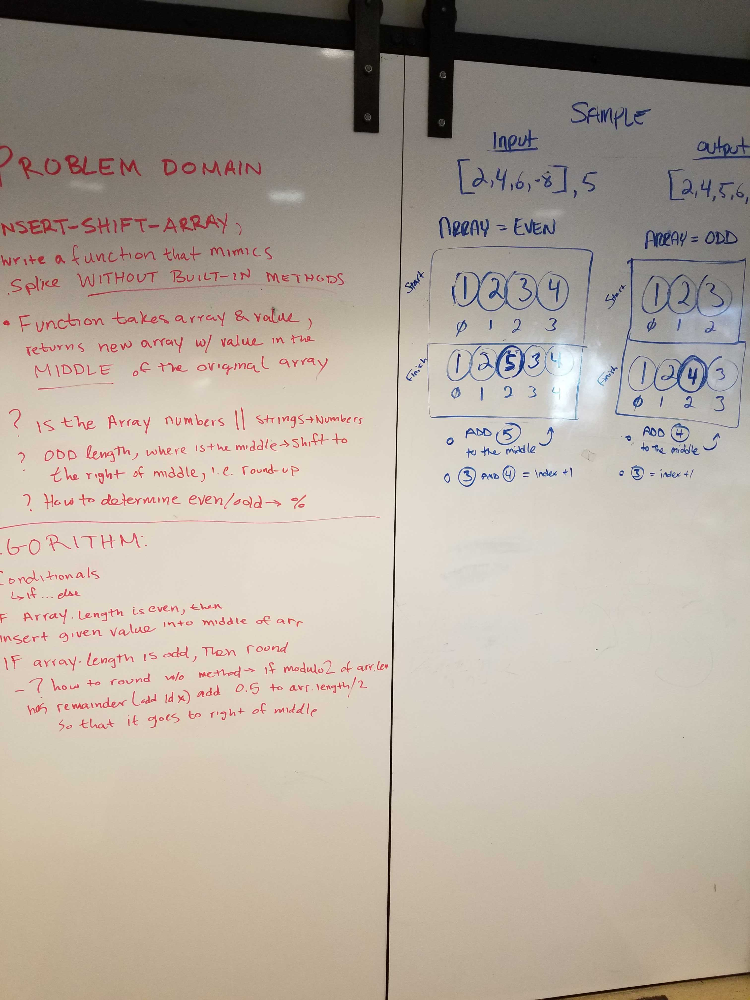

# Data Structures and Algorithms

See [setup instructions](https://codefellows.github.io/setup-guide/code-301/3-code-challenges), in the Code 301 Setup Guide.

## Repository Quick Tour and Usage

### 301 Code Challenges

Under the `javascript` folder, at the top level, is a sub-folder called `code-challenges`

Each day, you'll add one new file to this folder to do your work for the day's assigned code challenge

If you have not already done so, run `npm install` from within this folder to setup your system to be able to run tests using `Jest`

To run your tests

- Change to the `javascript` folder
- run `npm test` to run all of the tests
- run `npm test ##` to only run tests for challenge ## (i.e. 01)

### 401 Data Structures, Code Challenges

- Please follow the instructions specific to your 401 language, which can be found in the directory below, matching your course.

## WhiteBoard

[Code Challenge WhiteBoard: Class 01](javascript/401/code-challenges/code-challenge1/readme.md),
[Code Challenge WhiteBoard: Class 02](javascript/401/code-challenges/code-challenge2/readme.md),

