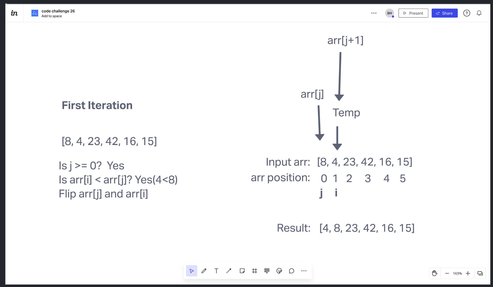

# Insertion Sort

### Big O space/time efficiency

The space efficiency is O(1) because the array is a set size and the sorting is being done in place, not with the use of a temporary array.
The time efficiency is O(n^2) because the worst case scenario is that the algorithm has to loop over the array with both a for loop and a while loop. If the array is already sorted, the while loop won't have to run.

