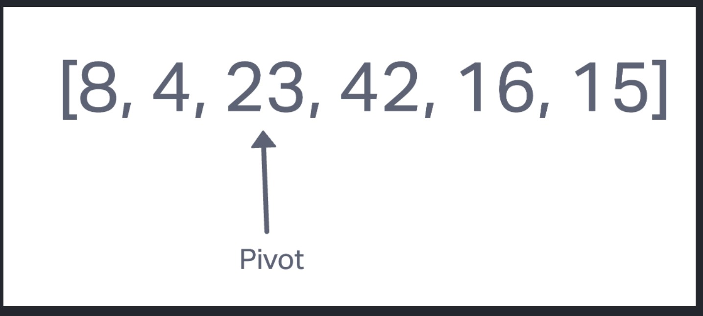
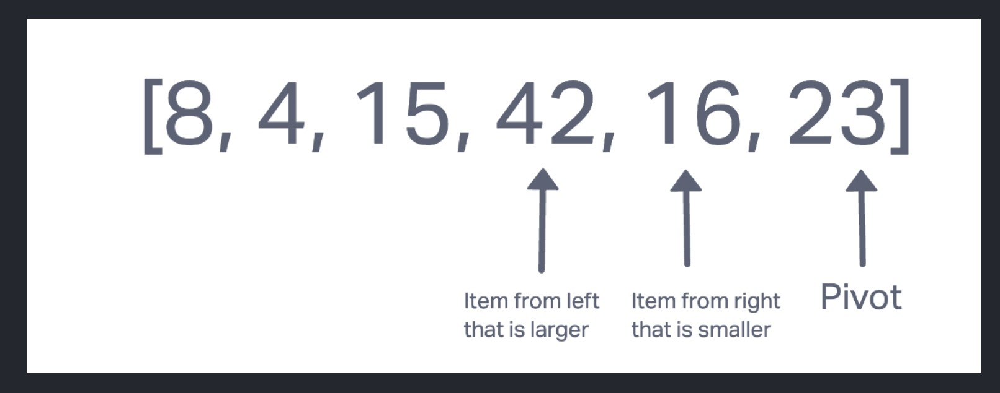
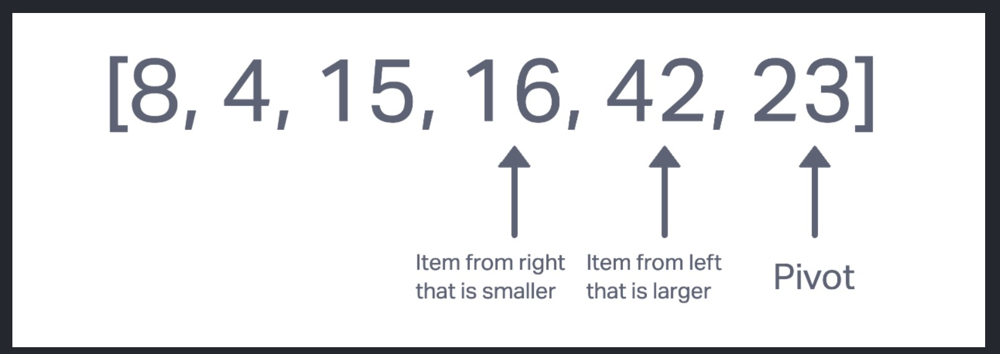
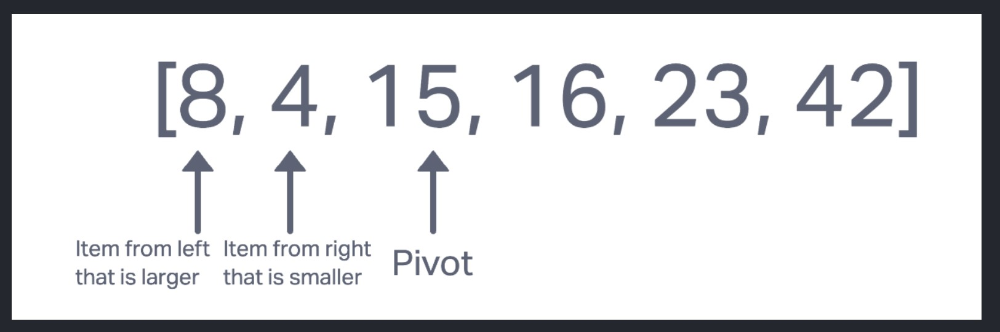
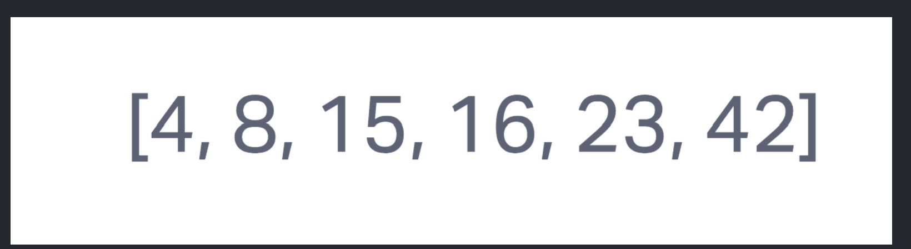

# Quick Sort

Review the pseudocode below, then trace the algorithm by stepping through the process with the provided sample array. Document your explanation by creating a blog article that shows the step-by-step output after each iteration through some sort of visual.
Once you are done with your article, code a working, tested implementation of Quick Sort based on the pseudocode provided.

### big O space/time efficiency

The time efficiency is O(logn) because while looping each time you loop through the array, the loop gets smaller and smaller so it does not scale with n.
The space efficiency is O(n) because in the worst case scenario it will have to scale with n.

## Blog Post 

We are going to sort an array using quick sort.

Choose a pivot point, here we have selected 23 as the pivot. We are going swap it with the value at the end of the array.

Now we are going to look for two things.

- Item from the left that is larger than the pivot
- Item from the right that is smaller than the pivot

We now are going to swap those values.

We are going to repeat this process until the value of the item from the left is greater than the value of the item from the right

We now swap the item from the left with the pivot and now the pivot is in the correct index.

We now pick a new pivot within the unsorted partition of the array and repeat the process.

We now have an assorted array using quicksort.

## Quick Sort Pseudo Code

The pseudo code creates a function called quickSort() that takes in an array of integers, the left index of that array, and the right index of that array as arguments, and sorts them in place from the lowest to the highest value.

We can understand the pseudo code by reading it line by line like this.

##### ALGORITHM QuickSort

- `if left < right` This line is saying if the left index is less than the right index, perform the following...
- `DEFINE position <-- Partition(arr, left, right)` The following is that the variable will be initialized as the result of the function partition(arr, left, right).
- `QuickSort(arr, left, position - 1)` This line will call quickSort on (arr, left, position - 1) decrementing the position variable in the right
- `QuickSort(arr, position + 1, right)` This line will then call quickSort on (arr, position + 1, right) incrementing the position variable in the left.

##### ALGORITHM partition

- `DEFINE pivot <-- arr[right]` This line will initialize a variable called pivot set equal to the value in the array at the right index value.
- `DEFINE low <-- left - 1` This line will initialize a variable called low that is then set equal to the left index minus 1.
- `for i <- left to right do` This line is saying that it will loop where i starts at the left index value and loops until it is equal to the right index value.
- `if arr[i] <= pivot` This line evaluates if the value in the aray at the index i is less than or equal to the pivot value.
- `low++` This line is just incrementing the value of low by 1.
- `Swap(arr, i, low)` On this line the swap() helper function is called with the arr, i, and low arguments.
- `Swap(arr, right, low + 1), call the swap()` This line will call the swap() helper function with arr, right, and low + 1 as arguments.
- `return low + 1`  This line justs returns the value of low + 1.

##### ALGORITHM Swap

- `DEFINE temp;` This line will initialize a variable called temp with no value assigned.
- `temp <-- arr[i]` This line will set the variable temp equal to the value in the array at index i.
- `arr[i] <-- arr[low]` This line sets the value in the array at index i to the value in the array at index low.
- `arr[low] <-- temp` And finally, this line will set the value in the array at index low to the temp value.

Test: npm test quick-sort

