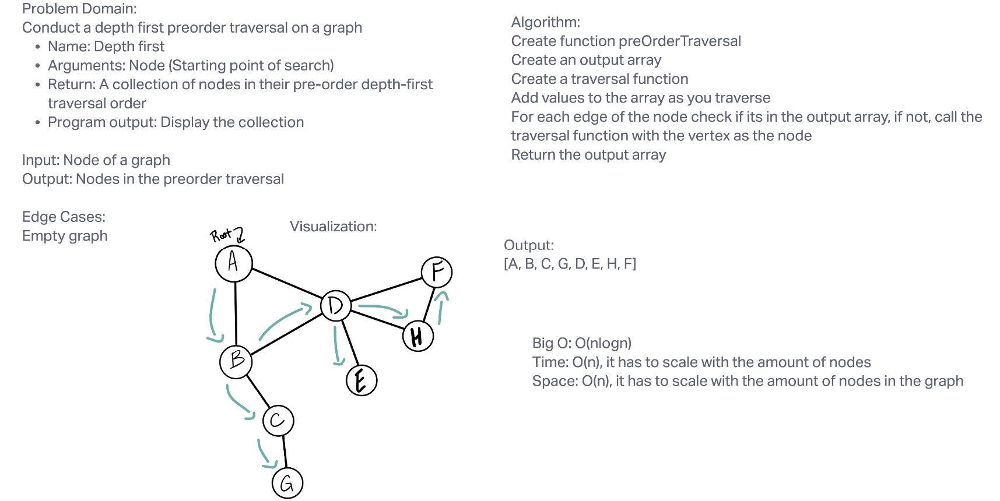
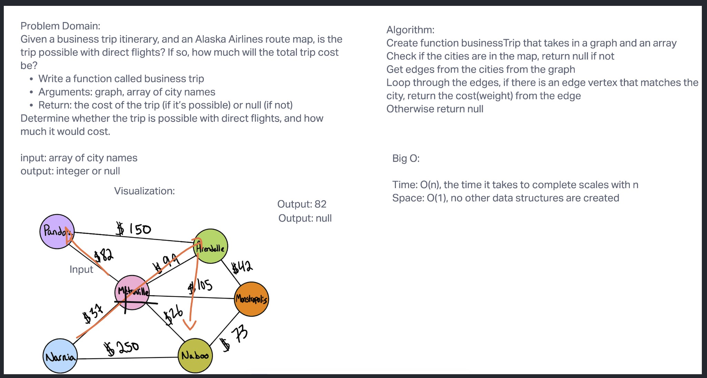
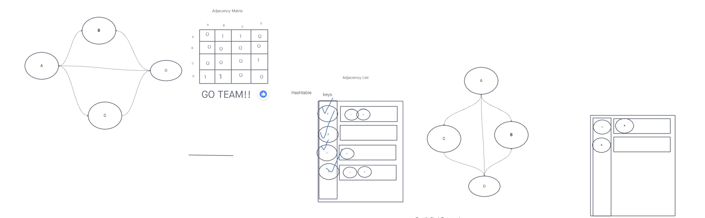
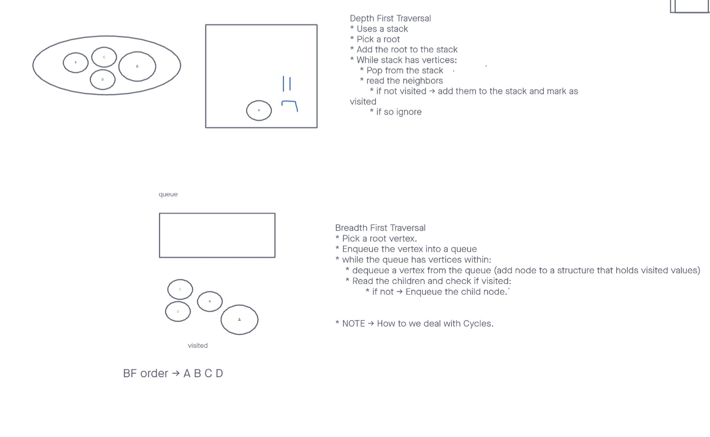

# Graph

## Graph Depth First

Implement a breadth-first traversal on a graph.

## Challenge

Write the following method for the Graph class:

- `breadthFirst`
  - Arguments: vertex
  - Return: A collection of vertices in the order they were visited.

## Approach and Efficiency

The solution I implemented is based mostly on what we were shown during the Graphs lecture. I did use my own Queue class for queueing up vertices to be traversed.

The time and space complexity are both O(n).

Test: npm test graph-depth-first.js

## Graph business trip

Utilize the Single-responsibility principle: any methods you write should be clean, reusable, abstract component parts to the whole challenge. You will be given feedback and marked down if you attempt to define a large, complex algorithm in one function definition.

Test: npm test graph-business-trip.js

## Graph Breadth First

Utilize the Single-responsibility principle: any methods you write should be clean, reusable, abstract component parts to the whole challenge. You will be given feedback and marked down if you attempt to define a large, complex algorithm in one function definition.

Test: npm test graph-breadth-first.js

## Graph

Graph implementation
The 2 most commonly used representations of graphs are the adjacency list and adjacency matrix.

The problems I’ll be solving are for sparse graphs (few edges), and the vertex operations in the adjacency list approach take constant (adding a vertex, O(1)) and linear time (deleting a vertex, O(V+E)). So I’ll stick with that implementation for the most part.

Let’s knock this out with a simple undirected, unweighted graph implementation using adjacency list. We’ll maintain an object (adjacencyList) that will contain all the vertices in our graph as the keys. The values will be an array of all the adjacent vertices. In the example below, vertex 1 is connected to vertices 2 and 4, hence adjacencyList: { 1 : [ 2, 4 ] } and so on for the other vertices.

To build the graph, we have two functions: addVertex and addEdge. addVertex is used to add a vertex to the list. addEdge is used to connect the vertices by adding the neighboring vertices to both the source and destination arrays since this is an undirected graph. To make a directed graph, we can simply remove lines 14–16 and 18 in the code below.

Before removing a vertex, we need to iterate through the array of neighboring vertices and remove all possible connections to that vertex.

Test: npm test graph.js

