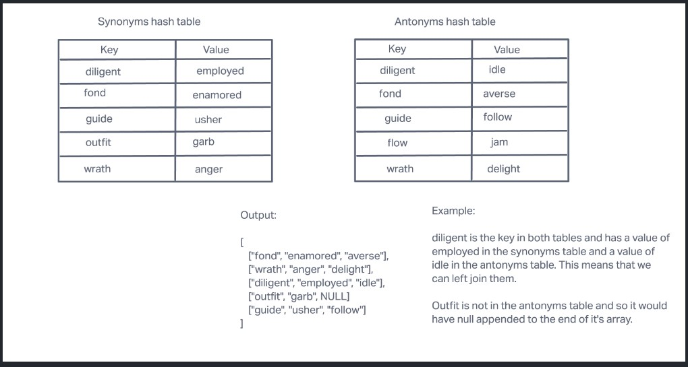
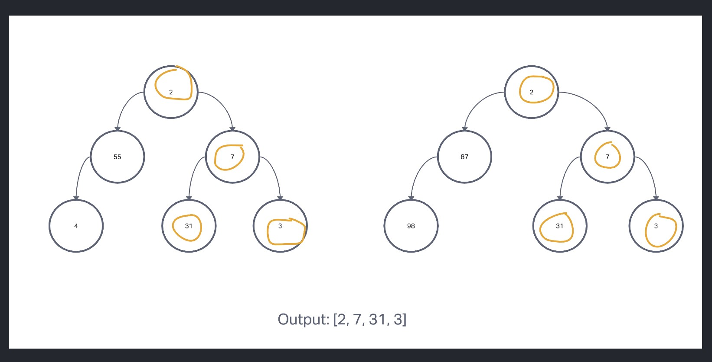
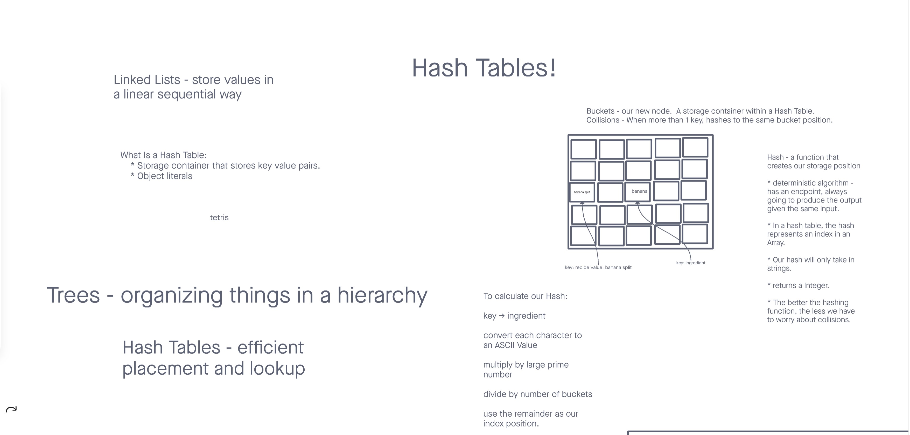

# Hashtables

## hashmap-left-join

Implement a simplified LEFT JOIN for 2 Hashmaps.

## Approach & Efficiency

The approach that I took for this was to loop through the first hashmap and put the key and value into the array. Then loop through the second array and if the key is also in the second hashmap, then push the value into the array. The big O of space for this would be O(n) because it will scale with the size of the hashmaps. The big O of time for this would be O(n) because it will have to scale with the size of the hashmap as well.

Test: npm test hashmap-left-join

## tree-intersection

### Challenge Summary

- Find common values in 2 binary trees.
- Write a function called tree_intersection that takes two binary trees as parameters.
- Using your Hashmap implementation as a part of your algorithm, return a set of values found in both trees.

Test: npm test tree-intersection

## hashmap-repeated-word

Write a function called repeated word that finds the first word to occur more than once in a string
Arguments: string
Return: string

## Structure

Utilize the Single-responsibility principle: any methods you write should be clean, reusable, abstract component parts to the whole challenge. You will be given feedback and marked down if you attempt to define a large, complex algorithm in one function definition.

Test: npm test hashmap-repeated-word

## Hashtables      

Hashtables are a data structure that utilize key value pairs. This means every Node or Bucket has both a key, and a value.

The basic idea of a hashtable is the ability to store the key into this data structure, and quickly retrieve the value. This is done through what we call a hash. A hash is the ability to encode the key that will eventually map to a specific location in the data structure that we can look at directly to retrieve the value.

Since we are able to hash our key and determine the exact location where our value is stored, we can do a lookup in an O(1) time complexity. This is ideal when quick lookups are required.

## Challenge
Features
Implement a Hashtable Class with the following methods:

set
Arguments: key, value
Returns: nothing
This method should hash the key, and set the key and value pair in the table, handling collisions as needed.
Should a given key already exist, replace its value from the value argument given to this method.
get
Arguments: key
Returns: Value associated with that key in the table
contains
Arguments: key
Returns: Boolean, indicating if the key exists in the table already.
keys
Returns: Collection of keys
hash
Arguments: key
Returns: Index in the collection for that key

Test: npm test hash-table
