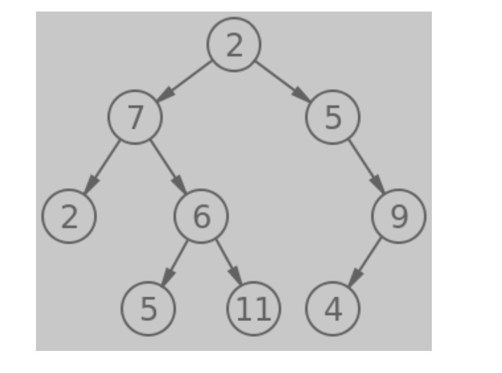
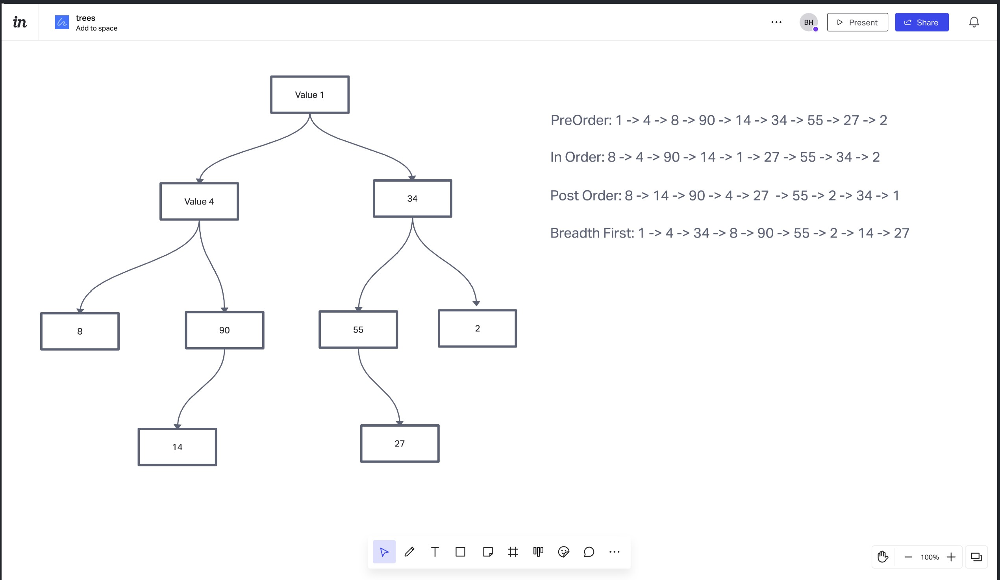

# Tree

## FizzBuzz

* Test npm test trees

## Write a function called fizz buzz tree

* Arguments: k-ary tree
* Return: new k-ary tree
* Determine whether or not the value of each node is divisible by 3, 5 or both. Create a new tree with the same structure as the original, but the values modified as follows:

* If the value is divisible by 3, replace the value with “Fizz”
* If the value is divisible by 5, replace the value with “Buzz”
* If the value is divisible by 3 and 5, replace the value with “FizzBuzz”
* If the value is not divisible by 3 or 5, simply turn the number into a String.

## tree-breadth-first.js

* Test npm test trees

## Feature Tasks

* Write a function called breadth first
* Arguments: tree
* Return: list of all values in the tree, in the order they were encountered

### NOTE: Traverse the input tree using a Breadth-first approach

Input:

Output
[2,7,5,2,6,9,5,11,4]

* Test npm test trees

## Tree-max

## Find the maximum value stored in the tree. You can assume that the values stored in the Binary Tree will be numeric.

## Space and time efficiency

## It has O(n) time efficiency because it has to scale through the whole tree so it will scale with n as it grows.

## It has O(1) space efficiency because it only has to track the max value so it will be linear

## Trees

* Test npm test trees

## How can we read all values in a Tree

## Depth First: Read all the sub children on one side of the tree, before reading children of the other side

## Pre Order: Current Node -> Left Subtree -> Right Subtree

## In Order: Left Subtree -> Current Node -> Right Subtree

## Post Order: Left Subtree -> Right Subtree -> Current Node

## Breadth First: Read all nodes on the current level, before traversing to subtrees

## The efficiency for preOrder, inOrder, and postOrder are all O(n) because it cycles through the tree once so it scales with n

