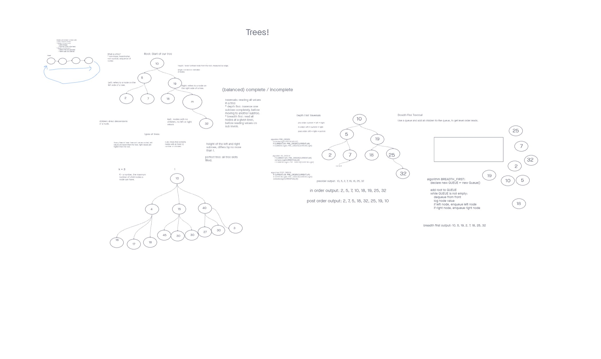

# Trees

## How can we read all values in a Tree

#### Depth First: Read all the sub children on one side of the tree, before reading children of the other side

#### Pre Order: Current Node -> Left Subtree -> Right Subtree

#### In Order: Left Subtree -> Current Node -> Right Subtree

#### Post Order: Left Subtree -> Right Subtree -> Current Node

#### Breadth First: Read all nodes on the current level, before traversing to subtrees

#### The efficiency for preOrder, inOrder, and postOrder are all O(n) because it cycles through the tree once so it scales with n

